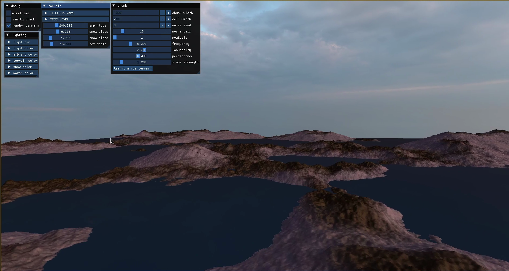
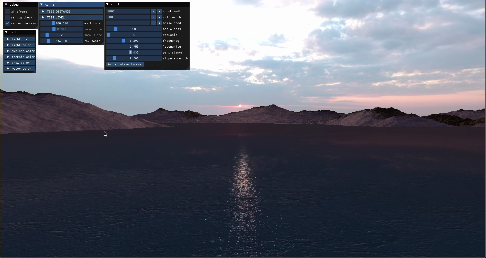

# Terrain Generator

A lightweight, cross-platform 3D rendering engine built using modern C++ and OpenGL. This project can generate infinitely loading terrain using perlin noise and opengl.

<!-- TODO: -->
## Screenshots



## Features
* Terrain generation using Fractal Perlin Noise
* Height based biome mapping (water and land)
* CMake Build System

## Structure

```text
terrain-generator/
├── resources/        # Assets like skyboxes and normal maps 
├── shaders/          # GLSL shaders
├── src/              # C++ source and header files
└── CMakeLists.txt    # CMake build configuration file
```

## Prerequisites

Before you begin, ensure you have the following installed on your machine:
* A C++17 (or newer) compatible compiler (GCC, Clang, or MSVC)
* [CMake](https://cmake.org/download/) (version 3.10 or higher)
* [dependencies](https://github.com/yashchaurasia667/cpp-dependencies)
* [Git](https://git-scm.com/)

## Building the Project

This project uses CMake for building. Follow these steps to build and run the terrain generator locally:

### 1. Clone the repository
```bash
git clone [https://github.com/yashchaurasia667/terrain-generato.git](https://github.com/yashchaurasia667/terrain-generator.git)
cd terrain-generator
```

### 2. Generate Build Files
Create a build directory and run CMake:
```bash
# On Linux
cmake . -B build -DCMAKE_BUILD_TYPE=Debug -DCMAKE_EXPORT_COMPILE_COMMANDS=ON

# On windows
cmake . -B build -G "MinGW Makefiles"

cd build
```

### 3. Compile the Project
```bash
make
```

### 4. Run the Renderer
After a successful build, the executable will be located in the `build` directory.
```bash
# On Linux/macOS
./terrain

# On Windows
./terrain.exe
```
